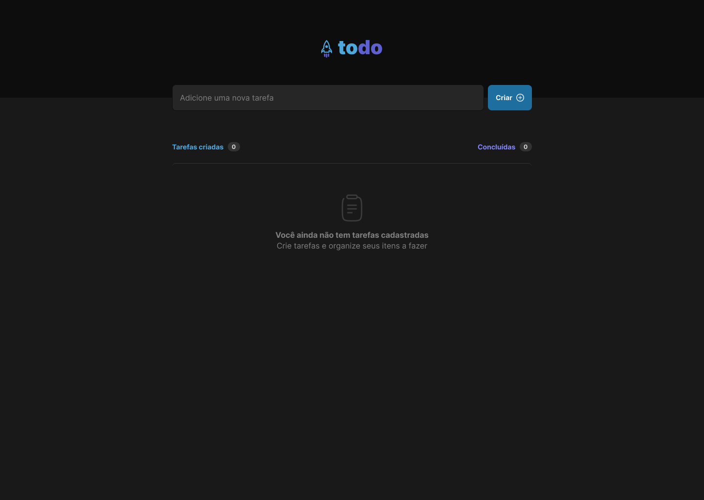
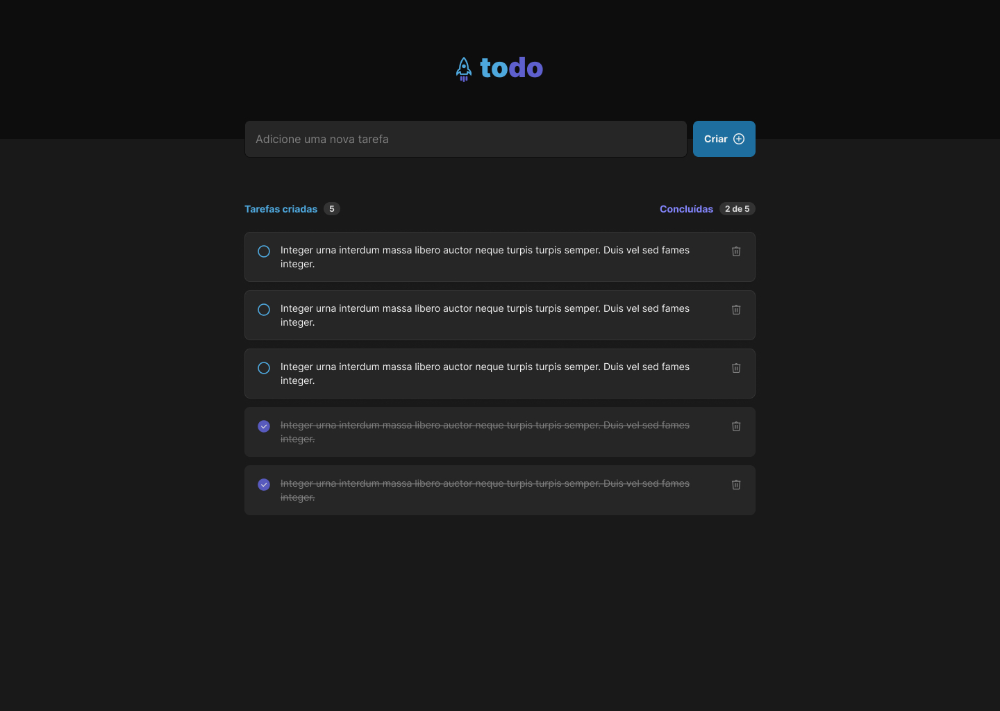

# ignite-reactjs-1-To-do

  
  

 

Project developed with __Vite__, __ReactJS__, __Typescript__

[Deploy's link](https://ignite-reactjs-1-to-o0s88az3x-cristianoalchaar.vercel.app/)

Challenge made for "Ignite" / [@Rocketseat](https://github.com/Rocketseat)

By [Cristiano Alchaar da Silva](https://github.com/CristianoAlchaar)

https://ignite-reactjs-1-to-o0s88az3x-cristianoalchaar.vercel.app/
